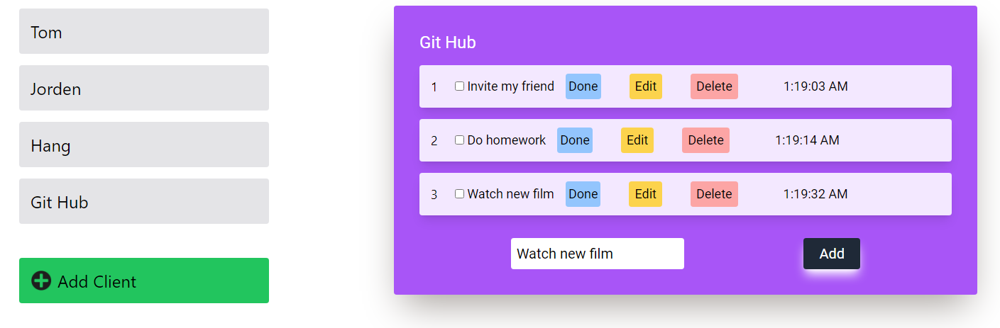

Created a todo app with TypeScript

Features ?

<ul>
    <li>Edit task name of todo</li>
    <li>Marked it When you finished your task</li>
    <li>Delete task after done that</li>
    <li>Have a special list , also there are some client </li>
</ul>

<h2>Looking around</h2>
